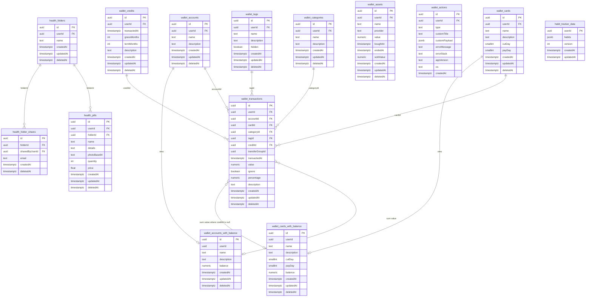

# Wallet

Personal finance app (accounts, cards, transactions) with Supabase auth and data.

Flutter **3.44.6** (see [`.tool-versions`](.tool-versions)). Android/iOS package: `io.github.danny270793.wallet`.

## Quick start

```sh
cp .env.example.json .env.json   # then fill in real values
asdf exec flutter pub get
asdf exec flutter run --dart-define-from-file=.env.json
```

## Documentation

- [Run on an emulator or device](docs/getting-started.md)
- [Fill `.env.json`](docs/environment.md)
- [Sync Xcode and publish to the App Store](docs/app-store.md)
- [Bump app version and Flutter SDK](docs/versioning.md)

## Database (Supabase)



- `wallet_transactions` is the hub. Month grouping uses `transactedAt`.
- Optional FKs: account, card, category, tag (`ON DELETE SET NULL`). Credit installments use `creditId` (`ON DELETE RESTRICT`).
- `transferGroupId` is a shared UUID for paired transfer legs, not a foreign key.
- Soft delete is `deletedAt`.
- `wallet_accounts_with_balance` / `wallet_cards_with_balance` are views: account balance is `sum(value)`; card balance excludes rows with `creditId`.
- Same project also has `health_*` and `habit_tracker_data`.

## Agents

See [AGENTS.md](AGENTS.md) (Claude: [CLAUDE.md](CLAUDE.md)).

